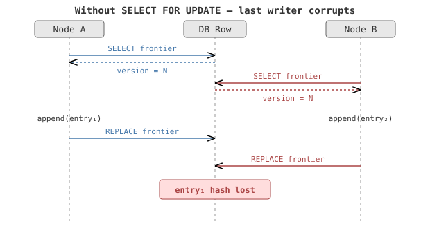
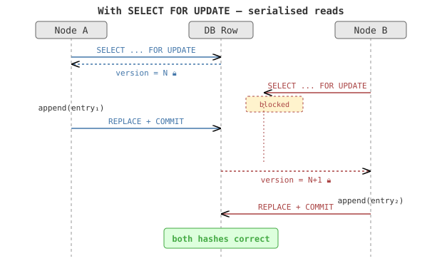
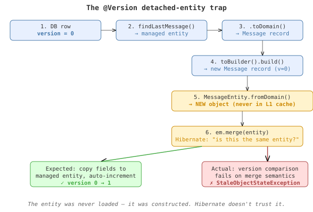

# The Merge That Lies

*Continues from [The Lock That Doesn't Lock](2026-10-06-mdp01-the-lock-that-doesnt-lock.md).*

The plan was three surgical locks. Two went exactly as designed. The third taught me something about Hibernate I should have known.

## The easy two

The Merkle frontier and commitment state transitions both have the same shape: read a row, modify it, write it back. In a single JVM, `synchronized` serialises this. Across JVMs, it doesn't. The fix is `SELECT FOR UPDATE` — the database acquires a row lock on the read, holding it until the transaction commits. A second node trying to read the same row blocks until the first is done.





Two new methods — `findBySubjectIdForUpdate` on the Merkle frontier repository, `findByCorrelationIdForUpdate` on the commitment store — each a near-duplicate of the existing read method with `setLockMode(PESSIMISTIC_WRITE)` added. The existing `synchronized` blocks stay for the single-JVM fast path. The database locks are the multi-node safety net.

## The plan for LAST_WRITE

LAST_WRITE channels felt different. Each sender keeps exactly one message; updates overwrite in place. The dispatch path reads the last message, copies its fields into a new message with updated content, increments the version manually, and calls `messageStore.put()`. A classic read-modify-write, but the modify step produces a new domain object rather than mutating the original.

The plan was `@Version` on `MessageEntity.version`. Optimistic locking: Hibernate adds `WHERE version = ?` to the UPDATE, throws `OptimisticLockException` if someone else got there first. No lock contention in the common case — just a version check at write time.

I removed the manual `.version(last.version() + 1)` call, added `@jakarta.persistence.Version` to the field, and ran the test.

```
StaleObjectStateException: Row was already updated or deleted
  by another transaction for entity [MessageEntity with id '1']
```

No concurrent transactions. No other threads. A single-threaded test doing two sequential dispatches to the same LAST_WRITE channel. The versions matched. The exception fired anyway.

## The domain record trap

Here is the path the LAST_WRITE update takes:



Step 5 is where it breaks. `fromDomain()` calls `new MessageEntity()` and copies every field — including the id and the version. The result is a brand-new Java object that Hibernate has never seen before, carrying an id that *does* exist in the L1 cache and a version that *should* match.

But `em.merge()` with `@Version` doesn't just compare version numbers. It compares the *identity* of the object against what the persistence context knows. A detached entity that was previously loaded — `em.find()` or a query result, then serialised, then returned — carries Hibernate's internal version tracking. A fresh object constructed from a domain record carries nothing. Hibernate sees an unfamiliar object claiming to represent a row it already manages, and treats it as stale.

The pattern — domain record as the canonical model, entity as a persistence detail, `fromDomain()` / `toDomain()` at the boundary — is a clean architecture choice. It decouples the domain layer from JPA. But it is fundamentally incompatible with `@Version` optimistic locking through `em.merge()`, because every "update" manufactures a new detached entity that the persistence context has no memory of.

## The fix

I dropped `@Version` and applied the same `SELECT FOR UPDATE` pattern used for the Merkle frontier and commitments. A new `findLastMessageForUpdate()` method locks the row before reading it. The manual version increment stays. All three subsystems now use the same concurrency strategy.

Consistency matters more than cleverness. Three identical patterns are easier to reason about than two pessimistic locks and one optimistic lock that requires understanding Hibernate's merge semantics with synthetic detached entities. The code is boring. That's the point.
