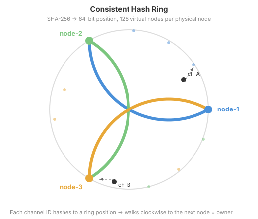
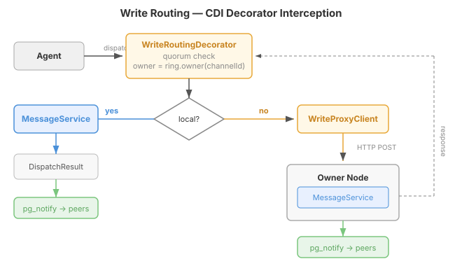
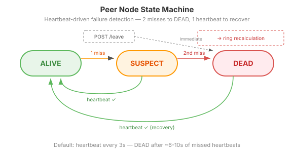

# The Ring That Routes

Phase 1 gave us the belt — database locks that guarantee correctness even when two nodes write to the same channel. Phase 2 builds the suspenders — a hash ring that ensures they never have to.

## Why a ring, not a proxy table

The question I kept coming back to: who decides which node owns a channel? One option is a lookup table in PostgreSQL — register ownership explicitly, query it on every write. It works, but it creates a coordination bottleneck. Every write needs a round-trip to the ownership table before the actual dispatch. Scale the node count and you're hammering a single table with ownership queries.

Consistent hashing eliminates the coordination entirely. Every node computes the same ring from the same sorted peer list. No queries, no shared state, no consensus protocol. Given a channel ID, any node can answer "who owns this?" in a single in-memory hash lookup.

The ring uses SHA-256 truncated to 64 bits. Each physical node maps to 128 virtual node positions, which spreads channels evenly — with three nodes, the standard deviation of channel assignment is under 15% of the mean. When a node joins or leaves, consistent hashing's key property holds: only ~1/N channels move. Add a fourth node to a three-node cluster and roughly a quarter of channels migrate. The rest stay put.

## The decorator trick

The interesting design question was where to intercept writes. We could modify each protocol adapter — REST, MCP, A2A — to check ownership before dispatching. But that means three interception points, and every future adapter would need the same routing logic.

CDI decorators solve this at the service layer. A single `WriteRoutingDecorator` wraps `MessageDispatcher`. Every caller — REST endpoints, MCP tools, A2A JSON-RPC — goes through the same dispatch interface, and the decorator sits transparently in front of it.

The decorator does three things: checks quorum (refuses writes in a minority partition), looks up the channel owner on the ring, and either delegates to the local `MessageService` or proxies to the remote node via HTTP. The agent never knows or cares which node owns its channel. Any node accepts any request.

A second decorator wraps `ChannelManager` for create, delete, pause, and config mutations. Channel creation has a subtle wrinkle: the channel doesn't have an ID yet when `create()` is called. We pre-generate the UUID, route by it, and pass it to the owning node — the channel is born on the node that will own it for all future writes. No post-creation migration.

## The state machine that protects the ring

A hash ring is only as good as its membership list. If a node dies and nobody notices, writes to its channels hit a dead end. The heartbeat service polls each peer every three seconds, and the state machine decides when a node is truly gone.

One missed heartbeat → SUSPECT. A second consecutive miss → DEAD. The two-miss threshold absorbs transient network blips — a single dropped packet doesn't trigger a ring recalculation. When a node transitions to DEAD, the ring recalculates without it. The dead node's channels move to their next clockwise neighbour on the ring. PostgreSQL already has all the data — the new owner just starts serving those channels immediately, no state transfer needed.

Recovery is the reverse: a DEAD node sends a heartbeat, transitions back to ALIVE, and the ring rebalances. For planned maintenance, a graceful `POST /internal/leave` bypasses the heartbeat delay — peers recalculate the ring immediately.

The quorum check is the split-brain guard. A node serves writes only if it can reach a majority of configured peers. In a three-node cluster, that means at least two reachable (including self). A minority partition returns 503 with a `Retry-After` header. Reads are always served — stale reads are acceptable for cross-channel queries.

## What's actually built

The `casehub-qhorus-cluster` module is a plain library — not a Quarkus extension, no deployment module. All beans are gated behind `casehub.qhorus.cluster.enabled=true`. When disabled, the decorators don't exist, the heartbeat doesn't run, and qhorus behaves exactly as before. Zero overhead for single-node deployments.

Everything is CDI-free tested — the hash ring is a pure POJO, the cluster manager takes a `Clock` for deterministic time control, the heartbeat service takes a `Function<NodeInfo, HeartbeatResponse>` for injectable callers. Mockito for the decorators. No Quarkus test infrastructure needed.

The one API change to existing qhorus code: `ChannelCreateRequest` gains an optional `preAssignedId` field. When set, `Channel.fromRequest()` uses it instead of generating a random UUID. When absent, behaviour is unchanged. That's the entire footprint on the existing codebase — one optional field.

Phase 3 fills the REST API gaps (operations that currently only exist as MCP tools). Phase 4 wires the cluster module into the mesh app with PostgreSQL, a Dockerfile, and end-to-end multi-node testing. The ring routes; the database persists; `pg_notify` fans out. Three independent mechanisms, each verifiable on its own.
